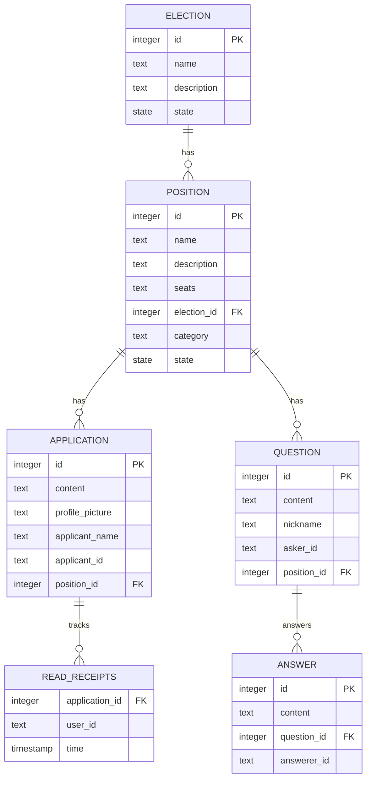

# Vaaliplatta

## Docs

### Setting up:
```bash
docker compose up -d
```

```bash
nvm use .nvmrc
```

```bash
# /vaaliplatta/backend
npm install
cp .env.template .env # Remember to check all values
npm run create-test-data
npm run dev

# /vaaliplatta/frontend
npm install
npm run dev
```


### Creating migrations:
1. Write a migration file with name "m[timestamp].ts" into `backend/src/migrations`. The migrations are applied by kysely-migrate in alphabetical order so naming convention has to be followed.
2. Add up and down methods according to examples.
```ts
export async function up(db: Kysely<any>): Promise<void> {}
export async function down(db: Kysely<any>): Promise<void> {}
```
3. The backend runs up migrations by default in [backend/src/index.ts](./backend/src/index.ts)

After running the migration up, you need to run `npm run kysely-codegen` to create types for the new db schema. This creates the file `db.d.ts`, which is tracked in git. Therefore, you only need to run kysely-codegen when creating new migrations.

If the migration fails in dev environment, just run docker compose down and docker compose up.

### DB schema

Generated with `dbmate dump` (has to be installed separately) and chatgpt. May not be entirely accurate.


