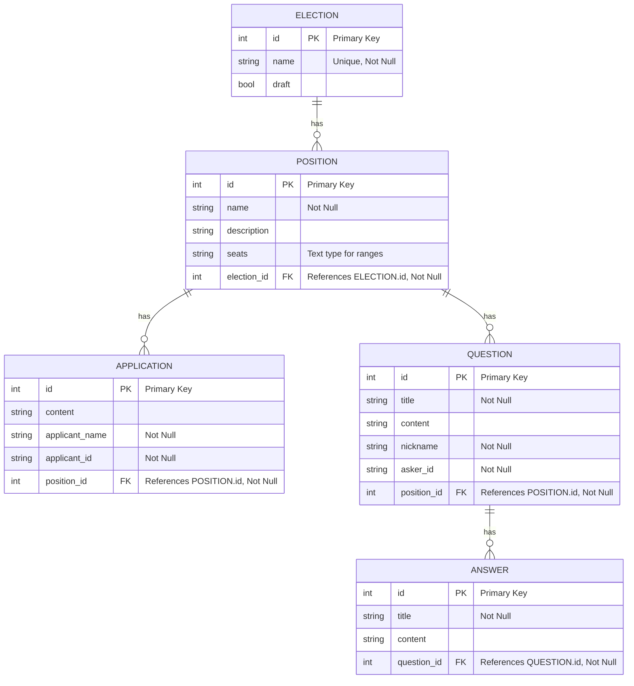

# Vaaliplatta

## Docs

Setting up:
```bash
docker compose up -d
```

```bash
# /vaaliplatta/backend
npm install
npm run kysely-codegen
npm run dev

# /vaaliplatta/frontend
npm install
npm run dev
```

### DB schema

